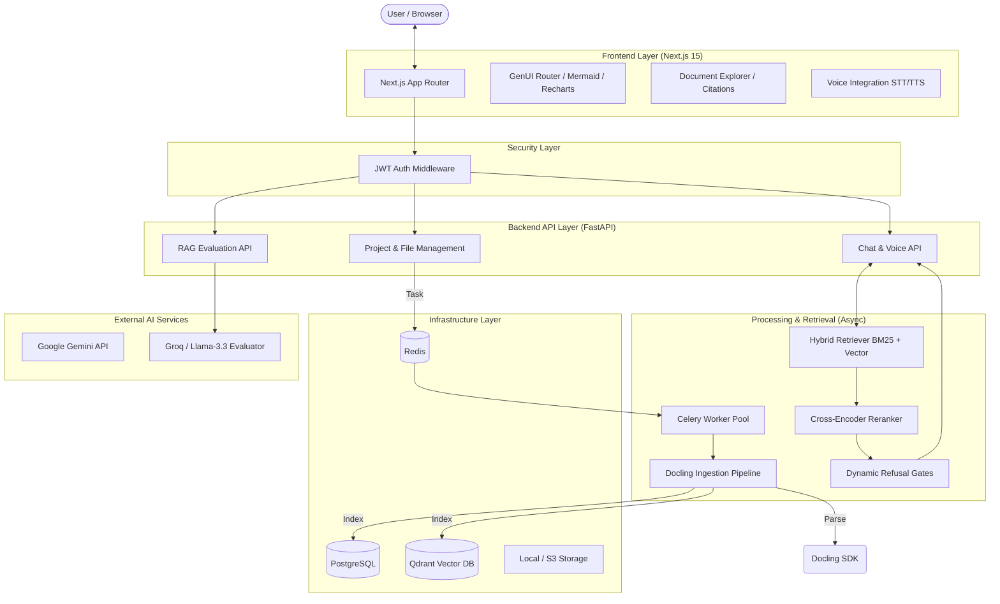

# 🚀 FinSight AI: Enterprise-Grade Financial Document Intelligence

FinSight AI is a production-ready, highly advanced Retrieval-Augmented Generation (RAG) platform tailored for the ingestion, querying, and analysis of complex documents such as financial reports, SEC filings, and corporate presentations.

Unlike standard RAG tutorials or basic wrappers, FinSight AI implements a robust, asynchronous backend architecture and an interactive, GenUI-powered frontend designed to deliver **low-latency**, **highly accurate**, and **fully auditable** conversational intelligence.

---

## 🏆 Why FinSight AI? (Competitive Advantage)
Standard RAG systems fail when faced with real-world financial documents. They destroy tabular data during naive text-splitting, retrieve irrelevant chunks using basic vector search, and hallucinate when they don't know the answer. 

**Here is how we solved these problems and built a vastly superior system:**

### 1. Structural Parsing over Naive Text Splitting
* **The Problem:** Naive chunking (e.g., splitting by 1000 characters) splits tables in half and merges unrelated paragraphs, destroying context.
* **Our Solution:** We integrated **Docling** for advanced layout extraction. Our pipeline understands the document's structure, preserving complex financial tables as Markdown/HTML and maintaining hierarchical relationships (Headings -> Paragraphs). This allows the LLM to read data exactly as it was formatted.

### 2. Multi-Stage "Agentic" Retrieval Pipeline
* **The Problem:** Basic dense vector search (Cosine Similarity) struggles with exact keyword matching (like ticker symbols or specific financial metrics).
* **Our Solution:** We built an enterprise-grade retrieval pipeline:
  1. **Hybrid Search**: We run Dense Vector Search (semantic meaning) and Sparse BM25 Search (exact keyword matching) in parallel using Qdrant.
  2. **Reciprocal Rank Fusion (RRF)**: We merge the results mathematically to get the best of both worlds.
  3. **Neural Reranking**: We pass the top candidates through a Cross-Encoder Neural Reranker for extreme precision.
  4. **Section Routing & Session Scoping**: The system uses conversation history to bias retrieval towards currently active document sections.

### 3. Dynamic Refusal Gates (Zero Hallucinations)
* **The Problem:** LLMs are eager to please and will hallucinate answers if the retrieved context doesn't contain the requested information.
* **Our Solution:** We implemented **Dynamic Refusal Gates**. The system mathematically evaluates the confidence scores from the retrieval pipeline. If the context isn't highly relevant, the system intentionally "refuses" to answer, guaranteeing zero hallucinations.

### 4. Generative UI (GenUI) & Interactive Visualizations
* **The Problem:** Financial analysis requires more than just text.
* **Our Solution:** The LLM dynamically streams structured JSON alongside text. The frontend intercepts this JSON and natively renders interactive **Recharts** (bar charts, line graphs) and **Mermaid.js** flowcharts directly inside the chat interface.

### 5. Document Explorer & Granular Citations
* **The Problem:** Users cannot trust AI without verification.
* **Our Solution:** Our LLM is heavily prompted to ground every claim with a chunk coordinate (e.g., `[cite:p2:c4]`). The frontend transforms these into clickable citation badges. Clicking a badge opens a resizable **Document Explorer** that scrolls to the exact source page and highlights the specific paragraph or table the LLM used.

### 6. Continuous Voice Interaction with Barge-In
* **The Problem:** Typing complex financial queries is tedious.
* **Our Solution:** We implemented a hands-free, end-to-end voice interface. It features real-time Speech-to-Text (STT), intelligent silence detection to auto-submit queries, and Text-to-Speech (TTS) for the response. Crucially, we implemented **Barge-In**, allowing users to interrupt the AI mid-sentence to ask follow-up questions.

---

## 📊 RAG Evaluation & Automated Metrics

To prove our system's superiority, we built an automated **LLM-as-a-Judge Evaluation Suite** directly into the platform. Users can evaluate any response in real-time.

Our evaluation pipeline uses Llama-3.3 (via Groq) to calculate:
* **Faithfulness (Target: >95%)**: Measures if the generated answer is strictly derived from the retrieved context.
* **Answer Relevance (Target: >90%)**: Measures how well the response directly addresses the user's initial query.
* **Context Relevance**: Measures the signal-to-noise ratio of our retrieval pipeline (did we retrieve the right chunks?).

Furthermore, our backend evaluation scripts track core Information Retrieval metrics:
* **Hit Rate**: Ensuring the correct document section appears in the top retrieved results.
* **Mean Reciprocal Rank (MRR)**: Ensuring the most relevant chunk is ranked as close to #1 as possible.

---

## 🏗️ High-Level Architecture

The system is built on a distributed micro-services architecture, optimized for high-throughput document processing and low-latency interactive queries.



---

## 🛠️ Advanced Technology Stack

### Frontend Ecosystem
*   **Framework**: Next.js 15 (App Router), React 19, TypeScript, Tailwind CSS.
*   **Visual Intelligence**: 
    *   **GenUI**: Dynamic rendering of LLM-generated JSON into interactive UI components (Recharts).
    *   **Mermaid.js**: Direct rendering of system architecture and financial flowcharts within chat.
    *   **Document Explorer**: Coordinate-mapped PDF viewer for precise citation jumping and source verification.
*   **Interaction**: WebSockets for real-time Voice STT/TTS, SSE (Server-Sent Events) for streaming chat.

### Backend & AI
*   **Core**: FastAPI, Pydantic v2, SQLAlchemy 2.0 (Asyncpg).
*   **Retrieval Engine**: 
    *   **Parsing**: Docling SDK for structural layout extraction (preserving complex tables and headers).
    *   **Search**: Hybrid (Dense Vector via Qdrant + Sparse Lexical via BM25).
    *   **Fusion**: Reciprocal Rank Fusion (RRF) to unify disparate search signals.
    *   **Refinement**: Neural Reranking using cross-encoders for final context selection.
    *   **Guardrails**: Refusal Gates with Dynamic Thresholding to prevent hallucinations.

### Security & Infrastructure
*   **Auth**: JWT-based session management, `bcrypt` password hashing, and user-project isolation.
*   **Database**: PostgreSQL (Stateful metadata), Qdrant (High-dimensional vectors), Redis (Task broker & Cache).
*   **Asynchronous Processing**: Celery with a robust Windows-optimized configuration (`--pool=solo`).

---

## 🔄 Core Workflows

### A. Intelligent Document Ingestion
1.  **Structural Parsing**: Docling extracts layout primitives, identifying headings, paragraphs, and tables with bounding boxes.
2.  **Logical Chunking**: `StructuralChunker` slices documents based on the extracted hierarchy.
3.  **Contextual Enrichment**: LLMs summarize chunks and extract key metadata to enrich the index.
4.  **Dual Indexing**: Chunks are embedded in Qdrant; lexical signatures are indexed in BM25.

### B. Multi-Stage Retrieval Pipeline (RAG)
1.  **Section Routing**: Predicts relevant document sections to narrow the search space.
2.  **Session Scoping**: Incorporates conversation history to bias retrieval.
3.  **Hybrid Retrieval**: Parallel search across Vector and BM25 indices.
4.  **RRF Merger**: Harmonizes results using Reciprocal Rank Fusion.
5.  **Neural Reranking**: A cross-encoder re-scores candidates for final precision.
6.  **Refusal Gate**: Dynamically evaluates if the top-scored context is sufficient.

---

## 🚀 Execution & Development Strategy

FinSight AI employs a **Hybrid Execution Model** optimized for rapid development:

1.  **Infra-in-Docker**: Stateful services (PostgreSQL, Redis, Qdrant) run in containers via `docker-compose.infra.yml`.
2.  **App-on-Host**: The application code (FastAPI, Celery, Next.js) runs natively, ensuring instant hot-reloading and native performance for heavy Docling/Torch operations.
3.  **Celery Solo Pool**: On Windows, we utilize `--pool=solo` to ensure thread-safe processing of heavy PDF tasks.
4.  **Orchestrated Startup**: `start-local.ps1` handles environment verification, dependency checks, and synchronized boot-up.

---

## 🏁 Getting Started

1.  **Environment Setup:** Ensure your `.env` files in the root and `/backend` contain your required API keys (e.g., `GROQ_API_KEY`).
2.  **Start Services:** Execute the unified PowerShell orchestrator:
    ```powershell
    .\start-local.ps1
    ```
    *(To stop all services and containers later, run `.\start-local.ps1 -StopAll`)*
3.  **Access:**
    *   Frontend UI: [http://localhost:3000](http://localhost:3000)
    *   Backend API Docs: [http://localhost:8000/docs](http://localhost:8000/docs)
    *   Qdrant Dashboard: [http://localhost:6333/dashboard](http://localhost:6333/dashboard)
