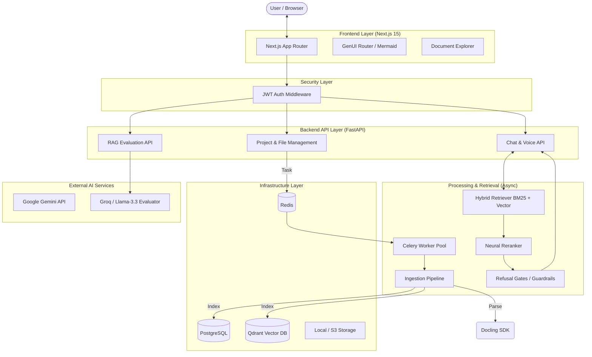

# FinSight AI: Advanced System Architecture & Documentation

FinSight AI is an enterprise-grade Financial Retrieval-Augmented Generation (RAG) platform designed to handle complex financial documents with high precision. It integrates advanced layout-aware parsing, a sophisticated multi-stage retrieval pipeline, real-time voice interaction, and automated RAG evaluation metrics.

## 1. High-Level Architecture

The system is built on a distributed micro-services architecture, optimized for high-throughput document processing and low-latency interactive queries.



---

## 2. Advanced Technology Stack

### Frontend Ecosystem
- **Framework**: Next.js 15 (App Router), React 19, TypeScript.
- **Visual Intelligence**: 
    - **GenUI**: Dynamic rendering of LLM-generated JSON into interactive UI components (Charts, Tables).
    - **Mermaid.js**: Direct rendering of system architecture and financial flowcharts within chat.
    - **Document Explorer**: Coordinate-mapped PDF viewer for precise citation jumping and source verification.
- **Interaction**: WebSockets for real-time Voice, SSE (Server-Sent Events) for streaming chat.

### Backend & AI
- **Core**: FastAPI, Pydantic v2, SQLAlchemy 2.0 (Asyncpg).
- **Retrieval Engine**: 
    - **Parsing**: Docling SDK for structural layout extraction (preserving complex tables and headers).
    - **Search**: Hybrid (Dense Vector via Qdrant + Sparse Lexical via BM25).
    - **Fusion**: Reciprocal Rank Fusion (RRF) to unify disparate search signals.
    - **Refinement**: Neural Reranking using cross-encoders for final context selection.
    - **Guardrails**: Refusal Gates with Dynamic Thresholding to prevent hallucinations and maintain factual grounding.
- **Voice**: Whisper-based STT (Speech-to-Text), real-time silence detection, and high-fidelity TTS (Text-to-Speech) with barge-in support.

### Security & Infrastructure
- **Auth**: JWT-based session management, `bcrypt` password hashing, and user-project isolation.
- **Database**: PostgreSQL (Stateful metadata), Qdrant (High-dimensional vectors), Redis (Task broker & Cache).
- **Asynchronous Processing**: Celery with a robust Windows-optimized configuration.

---

## 3. Core Workflows

### A. Intelligent Document Ingestion
Processing follows a layout-aware pipeline to ensure financial data integrity:
1.  **Structural Parsing**: Docling extracts layout primitives, identifying headings, paragraphs, and tables with bounding boxes.
2.  **Logical Chunking**: `StructuralChunker` slices documents based on the extracted hierarchy, ensuring tables are treated as atomic units.
3.  **Contextual Enrichment**: LLMs summarize chunks and extract key metadata (e.g., fiscal years, metrics) to enrich the sparse index.
4.  **Dual Indexing**: Chunks are embedded and stored in Qdrant, while their lexical signatures are indexed in BM25.

### B. Multi-Stage Retrieval Pipeline (RAG)
The system executes a sophisticated retrieval sequence for every query:
1.  **Section Routing**: Predicts relevant document sections to narrow the search space.
2.  **Session Scoping**: Incorporates conversation history to bias retrieval towards active topics.
3.  **Hybrid Retrieval**: Parallel search across Vector and BM25 indices.
4.  **RRF Merger**: Harmonizes results using Reciprocal Rank Fusion.
5.  **Neural Reranking**: A cross-encoder re-scores top candidates for final precision.
6.  **Refusal Gate**: Dynamically evaluates if the top-scored context is sufficient; returns a grounded "I don't know" if confidence is low.

### C. Voice Interaction & Barge-In
- **Real-time STT**: Continuous audio streaming over WebSockets.
- **Silence Detection**: Automatically initiates the RAG pipeline once the user finishes speaking.
- **Barge-In**: Users can interrupt the AI's audio response at any time, instantly stopping the playback and clearing the listener buffer for new input.

### D. Automated RAG Evaluation
A built-in benchmarking suite ensures continuous quality:
- **LLM-as-a-Judge**: Uses Llama-3.3 (via Groq) to evaluate **Faithfulness**, **Answer Relevance**, and **Context Relevance**.
- **Retrieval Metrics**: Tracks **Hit Rate**, **Recall@K**, and **Mean Reciprocal Rank (MRR)**.

---

## 4. Project Structure

```text
ps2_hydra/
├── backend/app/
│   ├── api/                  # Auth, Chat, Voice, Evaluation, Projects, Files
│   ├── ingestion/            # Docling parsing, chunking, enrichment pipelines
│   ├── retrieval/            # Hybrid search, reranking, routing, refusal gates
│   ├── models/               # SQLAlchemy ORM definitions & Pydantic schemas
│   ├── services/             # Business logic (ChatService, ProjectService)
│   └── core/                 # LLM clients, voice handlers, global config
├── frontend/src/
│   ├── components/
│   │   ├── chat/             # MessageBubble, CitationBadge, GenUIRouter
│   │   └── doc-explorer/     # PDF Viewer with coordinate-mapped citations
│   ├── lib/                  # API clients, WebSocket & SSE handlers
│   └── hooks/                # useChat, useVoice, useIngestionStatus
├── docker-compose.yml        # Full system stack orchestration
├── docker-compose.infra.yml  # Lightweight infra-only stack (Postgres/Redis/Qdrant)
└── start-local.ps1           # Windows-optimized native startup script
```

---

## 5. Execution & Development Strategy

FinSight AI employs a **Hybrid Execution Model** optimized for rapid development on Windows:

1.  **Infra-in-Docker**: Stateful services (PostgreSQL, Redis, Qdrant) run in containers via `docker-compose.infra.yml`.
2.  **App-on-Host**: The application code (FastAPI, Celery, Next.js) runs natively. This ensures:
    - **Instant Hot-Reload**: Changes reflect immediately without container rebuilds.
    - **Full Debugger Access**: Attach standard IDE debuggers directly to Python/Node processes.
    - **Native Performance**: No Docker-related filesystem or network overhead for heavy Docling/Torch operations.
3.  **Celery Solo Pool**: On Windows, we utilize the `--pool=solo` model to ensure thread-safe processing of heavy PDF ingestion tasks.
4.  **Orchestrated Startup**: The `start-local.ps1` script handles environment verification, dependency checks, and the synchronized boot-up of all layers.
